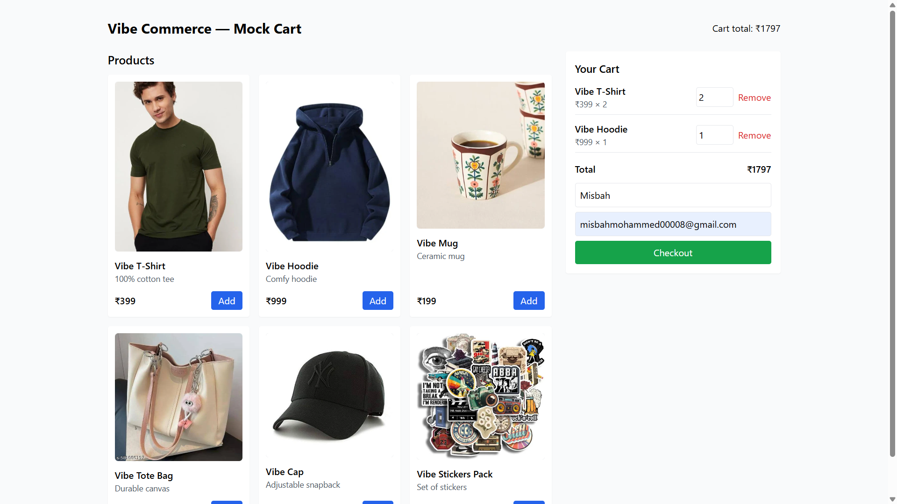
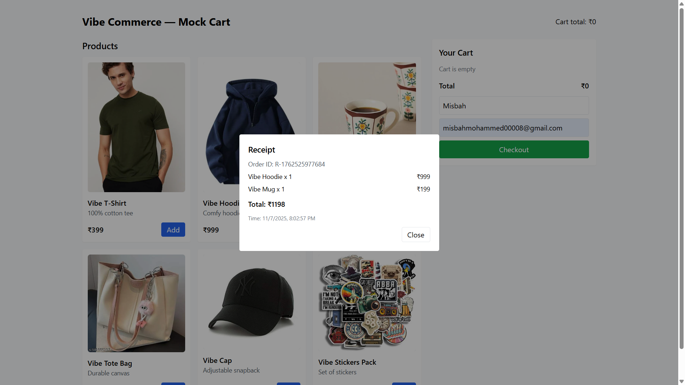

## 🧾 **README.md**

```markdown
# 🛍️ Mock E-Commerce Cart — Vibe Commerce Internship Assignment

This is a **Full Stack Shopping Cart Application** built using the **MERN Stack (MongoDB, Express, React, Node.js)** for the Vibe Commerce internship screening task.

It includes product listing, add/remove cart functionality, dynamic totals, and a mock checkout system — all integrated via REST APIs.

---

## 🚀 Live Demo / Video

🎥 **Demo Video:** [Watch Demo Video](https://drive.google.com/file/d/1gbge42EKXe8zXLscaeOphX91c5M2t64S/view?usp=sharing)

📂 **GitHub Repository:** https://github.com/misbah1408/mock-ecom-cart

---

## 🧠 Tech Stack

| Layer | Technology |
|-------|-------------|
| Frontend | React + Vite + Tailwind CSS |
| Backend | Node.js + Express |
| Database | MongoDB (local or Atlas) |
| Communication | REST API |
| Styling | Tailwind CSS (Responsive) |

---

## ⚙️ Features

✅ Product listing grid with “Add to Cart” buttons  
✅ Dynamic cart with quantity update and item removal  
✅ Real-time total calculation  
✅ Mock checkout form (name/email) → receipt modal  
✅ Responsive design for all screen sizes  
✅ MongoDB persistence (cart & products)  
✅ RESTful API integration between frontend and backend  

---

## 🧩 Folder Structure

```

mock-ecom-cart/
│
├── backend/
│   ├── config/
│   ├── models/
│   ├── routes/
│   ├── seed/
│   └── server.js
│
├── frontend/
│   ├── src/
│   │   ├── api/
│   │   ├── components/
│   │   ├── App.jsx
│   │   ├── main.jsx
│   │   └── index.css
│   ├── vite.config.mjs
│   ├── tailwind.config.cjs
│   └── postcss.config.cjs
│
└── README.md

````

---

## 🛠️ Setup Instructions

### 🧮 Backend Setup
1. Navigate to the backend folder:
   ```bash
   cd backend
   npm install
````

2. Create a `.env` file:

   ```
   PORT=5000
   MONGO_URI=mongodb://localhost:27017/mock-ecom
   ```
3. Seed mock products:

   ```bash
   npm run seed
   ```
4. Start the server:

   ```bash
   npm run dev
   ```

   ✅ Backend runs on: **[http://localhost:5000](http://localhost:5000)**

---

### 🖥️ Frontend Setup

1. Navigate to the frontend folder:

   ```bash
   cd frontend
   npm install
   ```
2. Create `.env` file:

   ```
   VITE_API_URL=http://localhost:5000/api
   ```
3. Run the React app:

   ```bash
   npm run dev
   ```

   ✅ Frontend runs on: **[http://localhost:5173](http://localhost:5173)**

---

## 📡 API Routes

| Method | Endpoint        | Description                              |
| ------ | --------------- | ---------------------------------------- |
| GET    | `/api/products` | Fetch all products                       |
| POST   | `/api/cart`     | Add product to cart `{ productId, qty }` |
| GET    | `/api/cart`     | Fetch current cart and total             |
| PATCH  | `/api/cart/:id` | Update quantity                          |
| DELETE | `/api/cart/:id` | Remove item from cart                    |
| POST   | `/api/checkout` | Mock checkout → returns receipt          |

---

## 🖼️ Screenshots

### 🏠 Home Page (Product Grid)


### 🛒 Cart Section



### 💳 Checkout Modal (Mock Receipt)



---

## 🧾 Demo Flow

1. Open the app → view product list fetched from backend.
2. Click **Add to Cart** → item appears in cart.
3. Update quantity / remove items.
4. Enter name and email → click **Checkout**.
5. Receipt modal appears with:

   * Ordered items
   * Total amount
   * Timestamp

---

## 🔐 Bonus Features (Optional Enhancements)

* ✅ Cart persistence per mock user (`x-user-id`)
* ✅ Error handling with response messages
* ⚙️ Optional FakeStore API integration
* ⚙️ Ready for real payment gateway integration (Stripe/Razorpay)

---

## 👨‍💻 Developer

**Mohammed Misba**
📧 [misbahmohammed00008@gmail.com](mailto:misbahmohammed00008@gmail.com)
🌐 [https://github.com/misbah1408](https://github.com/misbah1408)
💼 Aspiring Full Stack Developer | MERN | Python | Java

---